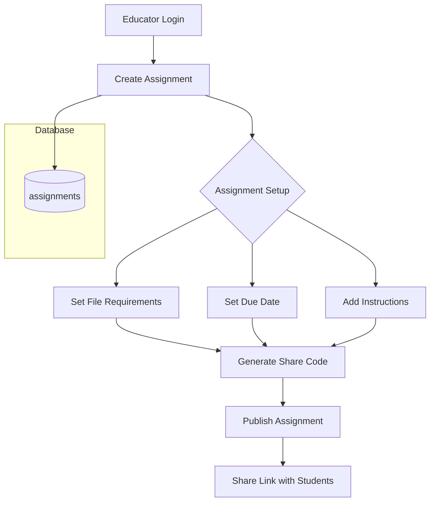
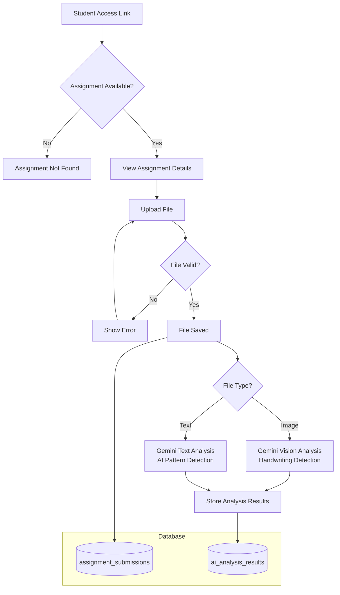
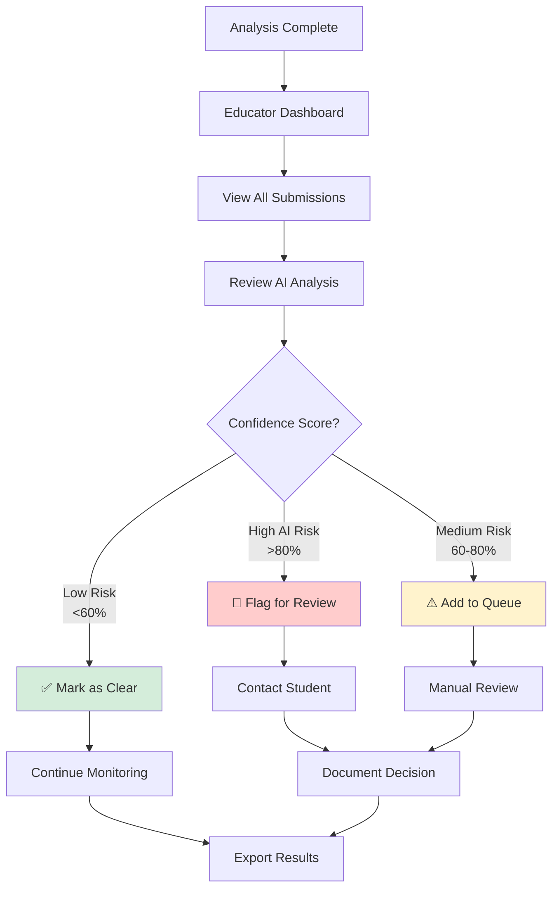

# Assignment Feature - Small Focused Diagrams

## 1. Educator Assignment Creation Flow

```mermaid
graph TD
    A[Educator Login] --> B[Create Assignment]
    B --> C{Assignment Setup}
    C --> D[Set File Requirements]
    C --> E[Set Due Date]
    C --> F[Add Instructions]
    D --> G[Generate Share Code]
    E --> G
    F --> G
    G --> H[Publish Assignment]
    H --> I[Share Link with Students]

    subgraph "Database"
        J[(assignments)]
    end

    B --> J
```

## 2. Student Submission & AI Analysis Flow

```mermaid
graph TD
    A[Student Access Link] --> B{Assignment Available?}
    B -->|No| C[Assignment Not Found]
    B -->|Yes| D[View Assignment Details]
    D --> E[Upload File]
    E --> F{File Valid?}
    F -->|No| G[Show Error]
    F -->|Yes| H[File Saved]
    G --> E

    H --> I{File Type?}
    I -->|Image| J[Gemini Vision Analysis<br/>Handwriting Detection]
    I -->|Text| K[Gemini Text Analysis<br/>AI Pattern Detection]
    J --> L[Store Analysis Results]
    K --> L

    subgraph "Database"
        M[(assignment_submissions)]
        N[(ai_analysis_results)]
    end

    H --> M
    L --> N
```

## 3. Educator Review & Decision Flow

```mermaid
graph TD
    A[Analysis Complete] --> B[Educator Dashboard]
    B --> C[View All Submissions]
    C --> D[Review AI Analysis]

    D --> E{Confidence Score?}
    E -->|High AI Risk<br/>>80%| F[🚨 Flag for Review]
    E -->|Medium Risk<br/>60-80%| G[⚠️ Add to Queue]
    E -->|Low Risk<br/><60%| H[✅ Mark as Clear]

    F --> I[Contact Student]
    G --> J[Manual Review]
    H --> K[Continue Monitoring]

    I --> L[Document Decision]
    J --> L
    K --> M[Export Results]
    L --> M

    style F fill:#ffcccc
    style G fill:#fff3cd
    style H fill:#d4edda
```