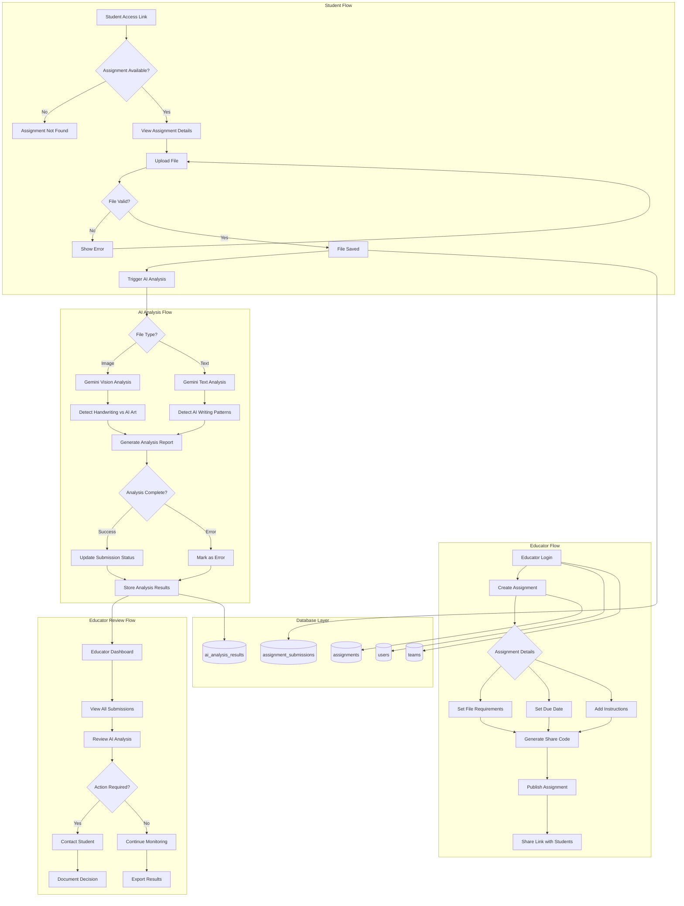
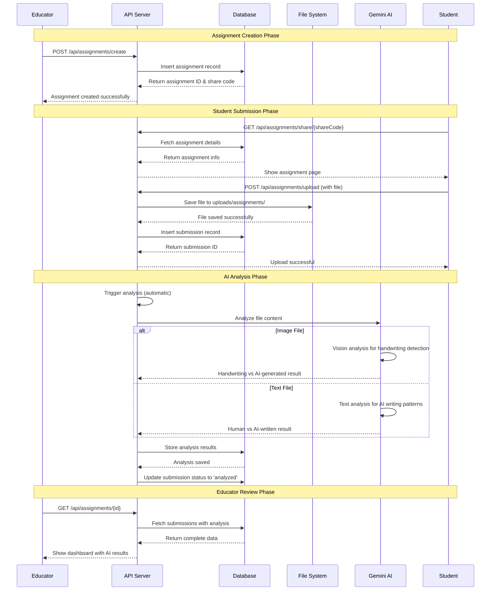
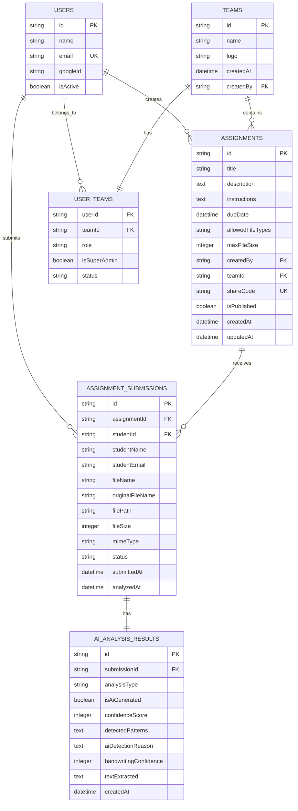
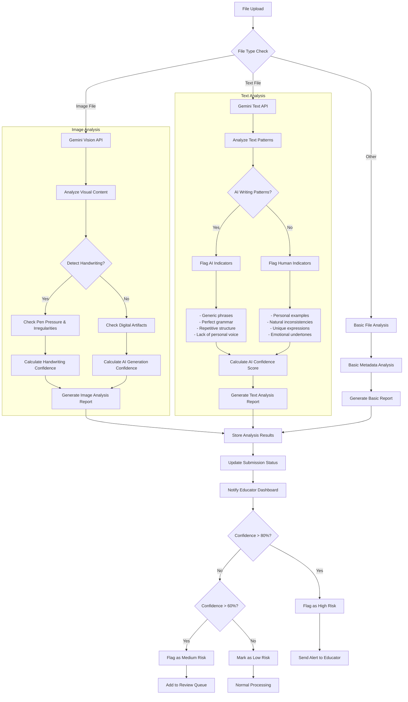
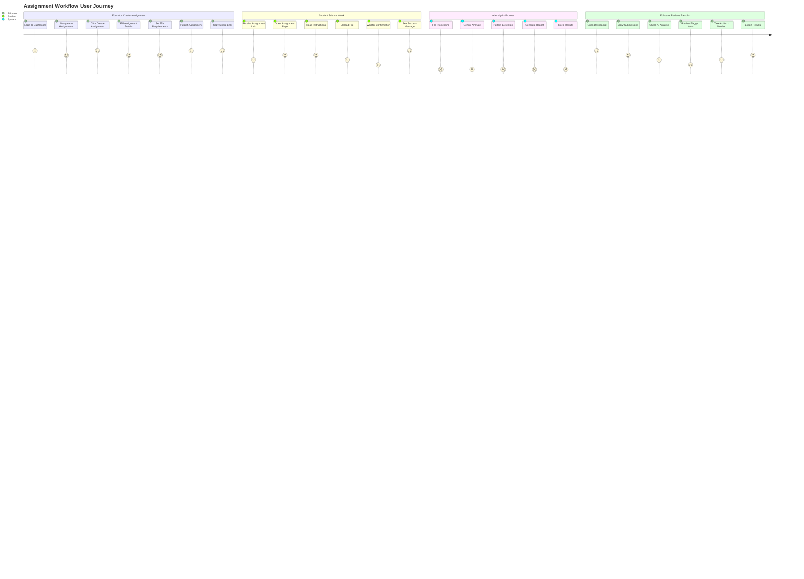

# Assignment Feature with AI Detection

## What This Feature Does

This assignment feature provides educators with a **Google Classroom-like file submission system** enhanced with **AI-powered content detection** to identify potentially AI-generated work.

### 🎯 **Core Purpose**
Help educators maintain academic integrity by automatically detecting AI-generated content in student submissions while providing a seamless assignment distribution and collection workflow.

### 📋 **Key Capabilities**

**For Educators:**
- ✅ Create file upload assignments with custom requirements (file types, size limits, due dates)
- ✅ Generate shareable assignment links (like Google Classroom)
- ✅ Automatically analyze all submissions using Gemini AI
- ✅ View AI detection results with confidence scores (0-100%)
- ✅ Get detailed analysis explaining why content was flagged
- ✅ Review submissions in a comprehensive dashboard
- ✅ Export results for record-keeping

**For Students:**
- ✅ Access assignments via simple share links (no account required)
- ✅ Upload files with drag-and-drop interface
- ✅ Get instant feedback on file validation
- ✅ See submission status and confirmation

**AI Detection Features:**
- 🧠 **Text Analysis** - Detects AI writing patterns, generic phrases, unnatural flow
- 👁️ **Image Analysis** - Distinguishes handwritten content from AI-generated images/art
- 📊 **Confidence Scoring** - Provides percentage confidence in AI detection
- 🎯 **Pattern Recognition** - Identifies specific indicators of AI generation
- ⚡ **Real-time Processing** - Analyzes files immediately after upload

### 🎨 **Use Cases**

1. **Essay Submissions** - Detect AI-written essays, reports, and written assignments
2. **Handwriting Assignments** - Verify authentic handwritten work vs digitally created content
3. **Creative Projects** - Identify AI-generated art, designs, or creative writing
4. **Code Submissions** - Flag AI-assisted programming assignments
5. **Research Papers** - Check for AI-generated research content

### 🔒 **Academic Integrity Benefits**

- **Proactive Detection** - Catch AI usage before grading
- **Evidence-Based** - Detailed reasoning for each detection
- **Graduated Response** - Risk-based flagging (High/Medium/Low confidence)
- **Documentation** - Complete audit trail for academic misconduct cases
- **Fair Assessment** - Helps ensure all students are evaluated equally

This feature transforms traditional file submission into an intelligent academic integrity monitoring system.

## System Architecture Diagram



## Detailed Component Flow



## Database Schema Relationships



## AI Detection Logic Flow



## User Interface Flow



## API Endpoints Overview

```mermaid
graph LR
    subgraph "Assignment Management"
        A[POST /api/assignments/create]
        B[GET /api/assignments/list]
        C[GET /api/assignments/{id}]
        D[PUT /api/assignments/{id}]
        E[DELETE /api/assignments/{id}]
    end

    subgraph "File & Submissions"
        F[POST /api/assignments/upload]
        G[GET /api/assignments/share/{shareCode}]
    end

    subgraph "AI Analysis"
        H[POST /api/assignments/analyze]
    end

    subgraph "Frontend Pages"
        I[/dashboard/assignments/create]
        J[/dashboard/assignments/library]
        K[/dashboard/assignments/view/{id}]
        L[/assignment/{shareCode}]
    end

    I --> A
    J --> B
    K --> C
    L --> G
    L --> F
    F --> H
```

## Security & Validation Flow

```mermaid
flowchart TD
    A[File Upload Request] --> B[Authentication Check]
    B --> C{User Authenticated?}
    C -->|No| D[Return 401 Unauthorized]
    C -->|Yes| E[Validate File Size]
    E --> F{Size Valid?}
    F -->|No| G[Return File Too Large Error]
    F -->|Yes| H[Validate File Type]
    H --> I{Type Allowed?}
    I -->|No| J[Return Invalid Type Error]
    I -->|Yes| K[Virus Scan (Future)]
    K --> L[Save to Secure Directory]
    L --> M[Generate Unique Filename]
    M --> N[Store Database Record]
    N --> O[Return Success]

    D --> P[Log Security Event]
    G --> P
    J --> P
    O --> Q[Trigger AI Analysis]
```

This comprehensive diagram set shows the complete flow of the assignment system with AI detection, from creation to analysis and review.