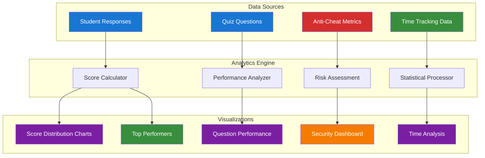

# Analytics Dashboard Architecture

```mermaid
graph TB
    subgraph "Data Sources"
        A[Student Responses]
        B[Quiz Questions]
        C[Anti-Cheat Metrics]
        D[Time Tracking Data]
    end
    
    subgraph "Analytics Engine"
        E[Score Calculator]
        F[Performance Analyzer]
        G[Risk Assessment]
        H[Statistical Processor]
    end
    
    subgraph "Visualizations"
        I[Score Distribution Charts]
        J[Question Performance]
        K[Security Dashboard]
        L[Time Analysis]
        M[Top Performers]
    end
    
    A --> E
    B --> F
    C --> G
    D --> H
    
    E --> I
    F --> J
    G --> K
    H --> L
    E --> M
    
    style A fill:#1976d2,color:#ffffff
    style B fill:#1976d2,color:#ffffff
    style C fill:#d32f2f,color:#ffffff
    style D fill:#388e3c,color:#ffffff
    
    style I fill:#7b1fa2,color:#ffffff
    style J fill:#7b1fa2,color:#ffffff
    style K fill:#f57c00,color:#ffffff
    style L fill:#7b1fa2,color:#ffffff
    style M fill:#388e3c,color:#ffffff
```

**Analytics Capabilities:**
- Real-time performance tracking
- Security risk assessment
- Interactive data visualizations
- Comprehensive reporting