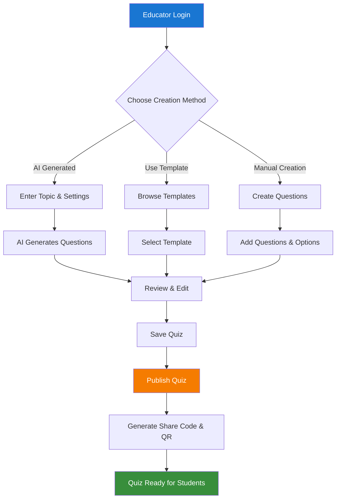

# Quiz Creation Flow

```mermaid
flowchart TD
    A[Educator Login] --> B{Choose Creation Method}
    B -->|AI Generated| C[Enter Topic & Settings]
    B -->|Use Template| D[Browse Templates]
    B -->|Manual Creation| E[Create Questions]
    
    C --> F[AI Generates Questions]
    D --> G[Select Template]
    E --> H[Add Questions & Options]
    
    F --> I[Review & Edit]
    G --> I
    H --> I
    
    I --> J[Save Quiz]
    J --> K[Publish Quiz]
    K --> L[Generate Share Code & QR]
    L --> M[Quiz Ready for Students]
    
    style A fill:#1976d2,color:#ffffff
    style M fill:#388e3c,color:#ffffff
    style K fill:#f57c00,color:#ffffff
```

**Key Features:**
- Multiple creation paths (AI, Templates, Manual)
- Review and edit capabilities
- Automatic share code generation
- QR code for easy distribution