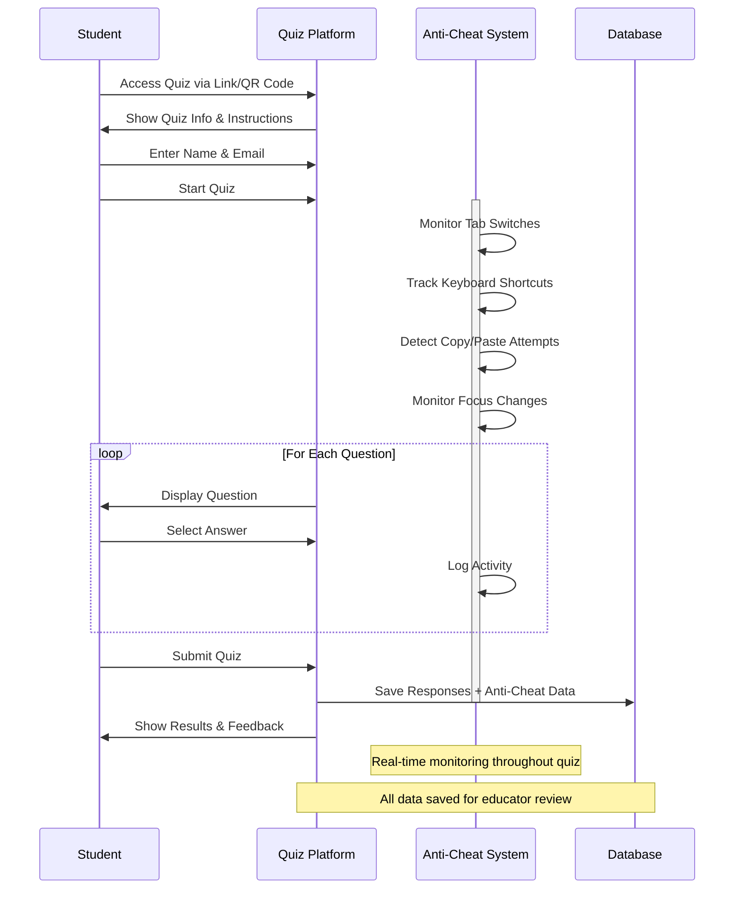

# Student Quiz Taking Experience

```mermaid
sequenceDiagram
    participant S as Student
    participant P as Quiz Platform
    participant AC as Anti-Cheat System
    participant DB as Database
    
    S->>P: Access Quiz via Link/QR Code
    P->>S: Show Quiz Info & Instructions
    S->>P: Enter Name & Email
    S->>P: Start Quiz
    
    activate AC
    AC->>AC: Monitor Tab Switches
    AC->>AC: Track Keyboard Shortcuts
    AC->>AC: Detect Copy/Paste Attempts
    AC->>AC: Monitor Focus Changes
    
    loop For Each Question
        P->>S: Display Question
        S->>P: Select Answer
        AC->>AC: Log Activity
    end
    
    S->>P: Submit Quiz
    P->>DB: Save Responses + Anti-Cheat Data
    deactivate AC
    
    P->>S: Show Results & Feedback
    
    Note over AC: Real-time monitoring throughout quiz
    Note over P,DB: All data saved for educator review
```

**Security Features:**
- Continuous anti-cheat monitoring
- Real-time activity logging
- Comprehensive data collection