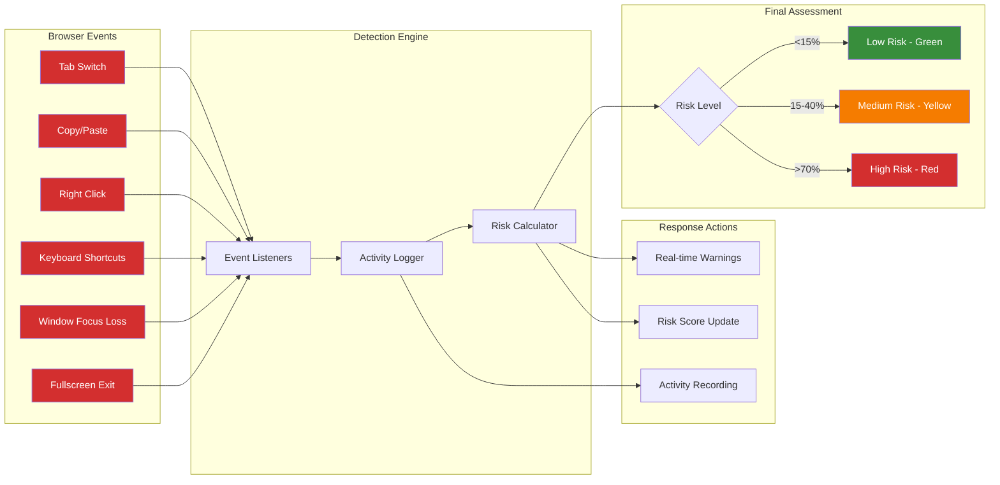

# Anti-Cheat Monitoring System

**Monitoring Features:**
- Real-time suspicious activity detection
- Dynamic risk scoring algorithm
- Immediate visual feedback to students
- Comprehensive data for educator review