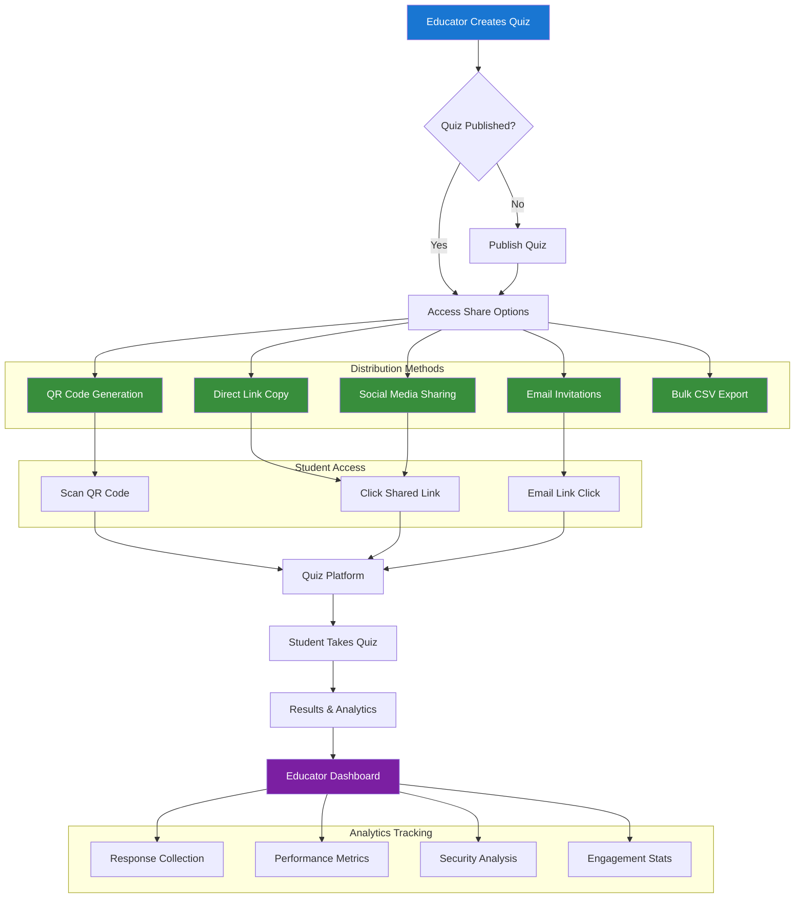

# Quiz Sharing & Distribution Workflow

**Distribution Features:**
- Multiple sharing channels
- QR code for mobile access
- Bulk student management
- Real-time analytics tracking
- Comprehensive engagement metrics